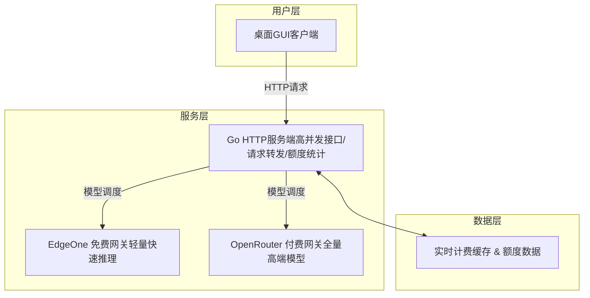

# EdgeOne-OpenRouter Dual AI Gateway Client

<p align="center">
<a href="https://github.com/Nathan-Peng/edgeone-openrouter-dual-ai-gateway-client/stargazers"></a>
<a href="https://github.com/Nathan-Peng/edgeone-openrouter-dual-ai-gateway-client/network/members"></a>
<a href="https://github.com/Nathan-Peng/edgeone-openrouter-dual-ai-gateway-client/issues"></a>
<a href="https://github.com/Nathan-Peng/edgeone-openrouter-dual-ai-gateway-client/blob/main/LICENSE"></a>
<a href="#"></a>
</p>

**一款基于 Go + Python 混合架构的 EdgeOne + OpenRouter 双网关AI可视化客户端**

> **双网关架构核心优势**
> 融合 Go 高并发后台服务 & Python 可视化GUI生态，原生双网关适配：支持 EdgeOne 免费额度模型日常使用，兼容 OpenRouter 全量商用付费高端模型，兼顾零成本体验与高精度AI推理能力，内置独立计费统计、实时额度监控、静默后台运行能力。

[English](./README_EN.md) | 简体中文

---

## 🏗️ 架构设计

本项目采用 **Go后端服务 + Python可视化客户端** 分离架构，各司其职、性能与体验兼顾：



- **Go 服务端**：轻量化高性能后端，静默后台运行，处理接口请求、端口监听、EdgeOne/OpenRouter双网关调度、额度统计、计费计算，低资源占用、高并发稳定。
- **Python 客户端**：基于PySide6打造精美可视化GUI，提供双网关切换、模型选择、对话交互、额度监控、独立账单查看、快捷操作能力。
- **原生双网关**：深度适配两大主流AI网关，一键无缝切换免费/付费模型，覆盖日常问答、深度推理、长文本处理、高端创作全场景。

## ✨ 核心特性

- **⚡ 静默后台运行**：服务端无黑窗口干扰，仅异常场景提示，开机即用、后台常驻。

- **🎨 极致UI交互**：分层模块化界面，AI回复/计费账单完全分离，快捷键发送、实时状态提示、按钮悬浮交互。
- **💰 精准计费统计**：独立账单面板，实时展示OpenRouter付费消耗、EdgeOne免费Token损耗、累计消费，额度分级预警。
- **🔄 双网关无缝切换**：原生适配 EdgeOne 免费模型 + OpenRouter 高端付费模型，按需切换、成本可控。
- **🔧 智能依赖检测**：启动脚本自动通过`pip show`校验依赖，缺失库静默安装，零配置开箱即用。
- **🛡️ 高稳定性**：全字段容错兜底、线程安全回收、端口检测防冲突、进程自动清理。
- **⌨️ 高效操作**：支持 `Ctrl+Enter` 快捷发送对话，一键清空内容、一键刷新额度、一键启停服务。

## 🚀 快速开始

### 环境准备

- **Go**: 1.20+（服务端编译运行）

- **Python**: 3.10+（GUI客户端运行）
- **系统**: Windows 10/11（原生适配）

### 项目结构

```
EdgeOne-ZMQ-Final-V1.0
├── start.bat        # 一键静默启动脚本（正式版）
├── stop.bat         # 一键终止所有进程
├── server/          # Go后端服务端程序
│   ├── server.exe
│   └── config.yaml  # 双网关密钥配置文件
└── client/          # Python可视化GUI客户端
    └── main_gui.py
```

### 安装与运行

1. **克隆项目**

```bash
git clone https://github.com/Nathan-Peng/edgeone-openrouter-dual-ai-gateway-client.git
cd edgeone-openrouter-dual-ai-gateway-client
```

1. **配置密钥**
修改 `server/config.yaml`，填入你的 EdgeOne、OpenRouter 网关密钥。

2. **一键启动**
双击项目根目录 `start.bat`

- 自动检测Python依赖、缺失库静默安装
- 后台静默启动Go服务端
- 弹出可视化AI客户端界面，自由切换双网关模型

1. **一键关闭**
双击 `stop.bat` 即可终止所有后台进程、释放端口。

## 📌 功能详解

### 1. 可视化额度监控

实时展示EdgeOne已用Token、剩余额度、占用比例、OpenRouter累计消费，分级提示：正常/偏低/严重不足/额度耗尽。

### 2. 双网关全量模型

- **EdgeOne免费网关**：DeepSeek V4 Flash、腾讯混元HY3、Kimi长文本模型（零成本使用）
- **OpenRouter付费网关**：DeepSeek系列、GPT-4o、Claude3、Llama3、Gemini全量主流高端模型（商用级推理）

### 3. 独立业务面板

- **AI回复面板**：纯净展示AI生成内容，无冗余信息
- **计费账单面板**：独立展示Token消耗、单次付费费用、累计消费、剩余免费额度，账目清晰可查

### 4. 交互优化

- 发送成功自动清空输入框，支持连续对话
- 请求中锁定按钮，防止重复请求
- 窗口尺寸自适应，杜绝界面挤压变形
- 全程中文友好提示，报错精准定位

## 🛡️ 稳定性保障

- 启动端口检测，避免端口占用冲突
- 依赖智能校验，不重复安装、启动速度快
- 所有接口字段容错兜底，杜绝程序闪退
- 窗口关闭自动回收线程、终止后台进程，无残留占用
- 超时/断连/异常请求统一友好提示

## 🗺️ 开发路线图

- [x] Go+Python混合架构搭建
- [x] EdgeOne+OpenRouter双网关深度适配
- [x] 独立账单与AI回复界面分离
- [x] 静默后台运行+智能依赖检测
- [x] 分级额度预警与精准计费统计
- [ ] 对话历史记录持久化
- [ ] 自定义模型参数配置
- [ ] 深色/浅色主题切换
- [ ] Linux/Mac跨平台适配

## 🤝 贡献指南

欢迎 Star、Fork、Issue & PR！
项目持续迭代优化，专注双网关AI客户端体验升级，欢迎各位开发者共同完善功能、修复BUG。

## 📄 开源许可

本项目基于 **MIT 许可证** 开源，可自由商用、二次开发，保留开源声明即可。
详情请参阅 [LICENSE](./LICENSE) 文件。

## 🙏 致谢

感谢 Go 高并发生态与 Python 可视化生态，以及 EdgeOne、OpenRouter 双网关服务，为本项目提供技术支撑。
